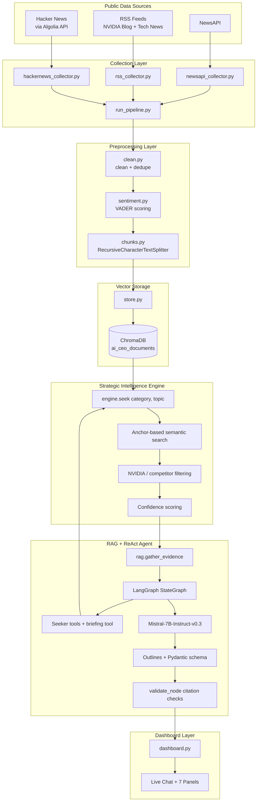
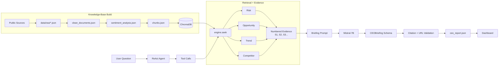

<div align="center">

# 🟢 AI-CEO — Strategic Intelligence Agent for NVIDIA

**An evidence-grounded RAG + ReAct system that answers one question:**

> _If you were the CEO of NVIDIA today, what strategic decision would you make next — and why?_


</div>

---

Instead of producing a generic LLM answer, AI-CEO first builds an internal evidence base from public data, retrieves category-specific strategic signals through a vector store, reasons over risks / opportunities / trends / competitor activity, and then generates a **schema-constrained CEO briefing** in which every claim is tied to a real, validated source.

The headline design principle: **the system is grounded, not generative-by-default.** Recommendations come from retrieved evidence, citations are verified by code, and the output structure is fixed — so the same question yields a consistent, auditable briefing every run.

---

## Table of Contents

- [Project Overview](#project-overview)
- [Key Features](#key-features)
- [System Architecture](#system-architecture)
- [Data-Flow Diagram](#data-flow-diagram)
- [The Seven-Stage Workflow](#the-seven-stage-workflow)
- [Tech Stack](#tech-stack)
- [Repository Structure](#repository-structure)
- [Design Decisions](#design-decisions)
- [Installation](#installation)
- [Configuration](#configuration)
- [How to Run](#how-to-run)
- [Output Schema](#output-schema)
- [Dashboard](#dashboard)
- [Limitations](#limitations)
- [Future Improvements](#future-improvements)

---

## Project Overview

AI-CEO acts as an AI strategic advisor for NVIDIA. It collects market / news / community intelligence, cleans and enriches it, chunks it, stores it in a persistent vector database, retrieves evidence through category-aware strategic search, and generates a CEO briefing using a **local, open-source** Hugging Face LLM (no paid APIs in the reasoning path).

The system separates a **batch knowledge-base build** from **live agent execution**:

| Stage | When it runs | What it does |
|---|---|---|
| Knowledge-base build | Periodic / on demand | Collect → clean → sentiment → chunk → embed into ChromaDB |
| Live intelligence | Per user question | Plan → retrieve evidence → reason → generate briefing → validate |

This split means the slow work (collection + embedding) happens once, and the dashboard/agent reuse the existing vector store for fast, repeated querying.

---

## Key Features

- Automated NVIDIA-focused data collection from **three independent public sources**.
- Cleaning, normalization, deduplication, VADER sentiment analysis, and chunking.
- Persistent **ChromaDB** vector store with rich document metadata.
- **Category-aware retrieval** — the same topic is searched differently as a risk vs. an opportunity vs. a trend.
- Hand-built **LangGraph ReAct agent** with autonomous, model-driven tool selection.
- **Schema-constrained generation** (Pydantic + Outlines) for a fixed, predictable briefing structure.
- **Deterministic answer formatting** — identical structured output across runs.
- **Code-based citation & URL validation** to flag fabricated sources.
- **Streamlit dashboard** with a live chat interface plus seven intelligence panels.

---

## System Architecture



---

## Data-Flow Diagram



---

## The Seven-Stage Workflow

The agent realizes an explicit strategic-reasoning workflow as a LangGraph `StateGraph`:

```text
Goal  →  Plan  →  Retrieve  →  Analyze  →  Decide  →  Recommend  →  Validate
```

| Stage | Where it lives | What happens |
|---|---|---|
| **Goal** | `ask(question)` | The user's strategic question enters the graph. |
| **Plan** | `plan_node.py` | A separate, tools-free generation states intent (which lenses look relevant) before any tool-calling. |
| **Retrieve** | `act_node` / `fallback_act` | The model's chosen seeker tools execute, calling `engine.seek()`. |
| **Analyze** | `engine.py` | `compute_confidence()` scores evidence by source diversity, sentiment fit, and recency. |
| **Decide** | `reason_node` | The model synthesizes evidence and decides whether a full briefing is warranted. |
| **Recommend** | `briefing.py` | `generate_ceo_briefing` produces strategic recommendations + a CEO action plan. |
| **Validate** | `validate_node.py` | Pure-code checks confirm every citation ID and URL is real — reported, not censored. |

### Retrieval detail — category-aware search

The engine does **not** search the bare user topic. It fuses the topic with category-specific anchor phrases, so the same words retrieve genuinely different evidence per strategic lens. A topic like `supply chain` under **risks** becomes:

```text
supply chain regulatory investigation
supply chain competitive threat
supply chain disruption
supply chain negative sentiment
```

The engine then keeps only chunks mentioning NVIDIA or known competitors, scores them, and deduplicates by `doc_id` (so "5 pieces of evidence" are 5 distinct documents, not 5 chunks of the same article).

### Generation detail — schema-constrained

`briefing.py` assembles the numbered evidence block, fills the prompt template, and runs **Outlines** with the `CEOBriefing` Pydantic schema. This forces valid, fixed-structure JSON rather than free-form text — the same sections, every time, with citations restricted to real `S`-IDs.

---

## Tech Stack

| Layer | Tools / Libraries |
|---|---|
| Language | Python 3.11 |
| Data Collection | `requests`, `feedparser`, `BeautifulSoup` |
| Config / Secrets | `python-dotenv` |
| Processing | `json`, `re`, `html`, `pandas` |
| Sentiment | `vaderSentiment` |
| Chunking | `langchain-text-splitters` |
| Vector DB | `chromadb` (embeddings: `all-MiniLM-L6-v2`) |
| Agent Framework | `langgraph`, `langchain-core` |
| LLM Runtime | `transformers`, `torch`, `accelerate` |
| Structured Generation | `outlines`, `pydantic` |
| Dashboard | `streamlit`, `plotly`, `pandas` |
| Public Tunnel | `pyngrok` |

**LLM:** `mistralai/Mistral-7B-Instruct-v0.3` — open-source, satisfies the no-paid-API constraint, loaded once as a shared singleton for both the chat loop and schema-constrained generation.

---

## Repository Structure

```text
AI-CEO/
│
├── agent/
│   ├── briefing.py          # Schema-constrained CEO briefing generation
│   ├── model.py             # Loads Mistral once; shared singleton
│   ├── plan_node.py         # PLAN stage (tools-free intent statement)
│   ├── prompt.py            # CEO briefing prompt template
│   ├── react_agent.py       # Main LangGraph ReAct agent + ask()
│   ├── schema.py            # Pydantic CEOBriefing schema
│   ├── tools.py             # LangChain tools wrapping the seekers + briefing
│   └── validate_node.py     # VALIDATE stage (citation + URL checks)
│
├── automate/
│   ├── block_1.py           # Knowledge-base build automation
│   ├── block_2.py           # Later-stage automation
│   └── full.py              # Full automation wrapper
│
├── collectors/
│   ├── newsapi_collector.py
│   ├── rss_collector.py
│   ├── hackernews_collector.py
│   ├── reddit_collector.py  # present but DISABLED (not in run_pipeline)
│   └── run_pipeline.py      # orchestrates the 3 active collectors
│
├── config/
│   ├── paths.py             # Centralized project paths
│   └── settings.py          # Model, chunking, retrieval, generation settings
│
├── dashboard/
│   ├── dashboard.py         # Streamlit intelligence dashboard
│   └── tunnel.py            # Optional ngrok tunnel helper
│
├── engine/
│   └── engine.py            # Strategic evidence retrieval engine — seek()
│
├── preprocess/
│   ├── clean.py             # Cleaning + deduplication
│   ├── sentiment.py         # VADER sentiment scoring
│   └── chunks.py            # Chunk generation
│
├── rag/
│   ├── __init__.py
│   └── rag.py               # Evidence gathering + RAG formatting
│
├── storage/
│   └── store.py             # Embeds + stores chunks into ChromaDB
│
├── data/
│   ├── raw/                 # Raw collected data + pipeline_meta.json
│   ├── cleaned/             # Cleaned docs, sentiment docs, chunks
│   ├── evidence/            # Latest CEO report (ceo_report.json)
│   └── vector_DB/           # Persistent ChromaDB store
│
├── main.py                  # Launches Streamlit + ngrok tunnel
├── requirements.txt
└── README.md
```

---

## Design Decisions

### 1. Hand-built ReAct loop, not the prebuilt agent

The prebuilt `langgraph` / `langchain` `create_react_agent` path (with `ChatHuggingFace`) never parsed this model's tool-call output into structured calls — it produced empty traces with raw instruction text leaking into answers. The loop is therefore built by hand using `apply_chat_template(tools=...)` directly, with a custom dual-format parser. This is the difference between a real agent and one that only *looks* like it calls tools.

### 2. No system prompt — confirmed by A/B test

Any system-role message — even one short sentence — **suppressed the model's native `[TOOL_CALLS]` emission** in this setup. A single line flipped a working tool-call case into plain narration. So `SYSTEM_PROMPT = None`, permanently; all routing guidance lives in the tool docstrings instead. This is a non-obvious, empirically-verified constraint, not a stylistic choice.

### 3. Category-aware retrieval instead of generic search

A bare similarity search on the user topic returns near-identical chunks regardless of strategic intent — it can't tell "supply chain as a threat" from "supply chain as an opportunity." Fusing the topic with category anchors steers each of the four searches toward its real meaning, guaranteeing coverage of all four strategic lenses rather than whatever is simply most similar to the question.

### 4. Deduplication by document, not by chunk

Evidence is deduplicated by `doc_id`, not `chunk_id`. Without this, five "pieces of evidence" could secretly be five overlapping chunks of the same article — starving the model of real variety and pushing it to pad schema-constrained fields with filler.

### 5. Structured generation over free-form text

The briefing is produced through a Pydantic schema enforced by Outlines, so the output always has the same sections with the same counts and only ever cites real source IDs. CEO reports must be consistent and auditable; free-form generation cannot guarantee that.

### 6. Deterministic answer formatting

Once the structured briefing dict exists, the chat answer is **formatted from that dict in code** — not re-narrated by the model. This eliminates run-to-run variance (the model sometimes summarized, sometimes dumped everything), removes a truncation bug, and guarantees the chat answer can never embellish beyond the validated briefing.

### 7. Validation verifies grounding, not facts

The validation node deterministically confirms that every citation ID and URL in the output actually exists in the retrieved evidence. It is important to be precise about scope: this catches **fabricated sources and links**, not semantic misreadings of a real source. Catching the latter would require an LLM-based fact-check layer — noted as future work.

### 8. Single model load

The raw chat-loop model and the Outlines-wrapped schema-generation model share one set of loaded weights via a singleton (`model.py`). Loading twice would roughly double GPU memory (~14.5 GB → ~29 GB).

---

## Installation

### 1. Clone the master branch

```bash
git clone -b master https://github.com/yuvrajghag5/AI-CEO.git
cd AI-CEO
```

### 2. Create and activate a virtual environment

```bash
# Linux / macOS
python -m venv .venv
source .venv/bin/activate

# Windows PowerShell
python -m venv .venv
.venv\Scripts\Activate.ps1
```

### 3. Install dependencies

```bash
pip install -r requirements.txt
```

---

## Configuration

### Environment variables

Create a `.env` file in the project root:

```env
NEWS_API_KEY=your_newsapi_key_here
```

Keys are read via `os.getenv("NEWS_API_KEY")`. **Do not commit real keys.**

### Key settings (`config/settings.py`)

| Setting | Value | Purpose |
|---|---|---|
| `MODEL` | `mistralai/Mistral-7B-Instruct-v0.3` | Local reasoning LLM |
| `CHUNK_SIZE` / `CHUNK_OVERLAP` | `400` / `40` | Text-splitter sizing |
| `TOP_K_PER_ANCHOR` | `10` | Chunks retrieved per anchor phrase |
| `CANDIDATE_POOL_SIZE` | `30` | Candidate pool before scoring |
| `TOP_K` | `7` | Final evidence kept for RAG |
| `TEMPERATURE` / `TOP_P` | `0.4` / `0.9` | Generation sampling |
| `REPETITION_PENALTY` | `1.1` | Discourages repetition |

---

## How to Run

### Build / update the knowledge base

```bash
# one-shot automation
python -m automate.block_1
```

…which runs, in order:

```text
collectors.run_pipeline → preprocess.clean → preprocess.sentiment
→ preprocess.chunks → storage.store
```

Or run each stage manually:

```bash
python -m collectors.run_pipeline
python -m preprocess.clean
python -m preprocess.sentiment
python -m preprocess.chunks
python -m storage.store
```

### Test the strategic engine

```bash
python -m engine.engine
```

### Run the interactive agent (terminal)

```bash
python -m agent.react_agent
```

Example questions:

```text
If you were the CEO of NVIDIA today, what would you do next and why?
What are NVIDIA's biggest risks in AI infrastructure?
How should NVIDIA respond to AMD and Intel in the data center GPU market?
```

### Run the dashboard

```bash
# locally
streamlit run dashboard/dashboard.py

# with public ngrok tunnel (port 8501)
python main.py
```

---

## Output Schema

The CEO briefing is produced through the `CEOBriefing` Pydantic schema. Evidence counts reflect the **actual** constraints in `schema.py`:

```text
CEOBriefing
├── executive_summary                  # >= 350 chars
├── key_opportunities                  # exactly 3 items
│   ├── opportunity
│   ├── business_impact                # >= 180 chars
│   └── supporting_evidence            # 1–3 source IDs
├── key_risks                          # exactly 3 items
│   ├── risk
│   ├── why_it_matters                 # >= 180 chars
│   └── supporting_evidence            # 1–3 source IDs
├── competitor_activity                # exactly 2 items
│   ├── competitor_activity
│   ├── strategic_meaning              # >= 180 chars
│   └── supporting_evidence            # 1–3 source IDs
├── emerging_trends                    # exactly 2 items
│   ├── trend
│   ├── strategic_meaning              # >= 180 chars
│   └── supporting_evidence            # 1–3 source IDs
├── strategic_recommendations          # exactly 3 items
│   ├── recommendation
│   ├── priority                       # High / Medium / Low
│   ├── supporting_evidence            # exactly 3 source IDs
│   ├── expected_impact                # >= 180 chars
│   └── risk_level                     # High / Medium / Low
└── ceo_action_plan                    # exactly 3 concrete actions
```

---

## Dashboard

A two-column Streamlit app: a **live chat** on the left (connected to `agent.react_agent.ask()`, with session memory), and **seven panels** as tabs on the right.

| Panel | Source | Shows |
|---|---|---|
| Overview | ChromaDB / corpus | Company, document count, source mix, last update |
| Market Intel | live briefing | Competitor activity + emerging trends |
| Opportunities | live briefing | Key strategic opportunities |
| Risks | live briefing | Risk monitor |
| Sentiment | `sentiment_analysis.json` | Distribution, by-source split, recent trend |
| Recommendations | live briefing | Recommendations with priority + risk |
| CEO Briefing | live briefing | Executive summary, action plan, validation, sources |

Each chat turn overwrites `data/evidence/ceo_report.json` with the latest result.

---

## Limitations

- Briefing quality depends on the freshness and quality of collected documents.
- Some sites block scraping, paywall content, or return limited text.
- Local Mistral-7B inference needs significant GPU memory and is slow on CPU.
- The vector store reflects only the latest stored chunks — re-run the build stage after collecting new data.
- Validation checks source **existence**, not factual correctness of how a source is interpreted.
- API keys must be handled via `.env` and never committed.

---

## Future Improvements

- Add reliable financial / market data sources.
- Replace hard-coded queries with configurable company/competitor profiles.
- Add scheduled collection and incremental embedding.
- Add an LLM-based fact-check layer on top of citation validation.
- Add source-quality ranking and cross-category deduplication.
- Add CEO-report export to PDF / Markdown.
- Add retrieval-quality and citation-accuracy evaluation metrics.
- Add Docker support and unit tests.

---

<div align="center">

**Public Data → Knowledge Base → Vector Retrieval → Strategic Evidence → RAG Agent → Validated CEO Briefing → Dashboard**

_Every recommendation is grounded in retrieved internal evidence — not generated from the model's prior knowledge alone._

</div>