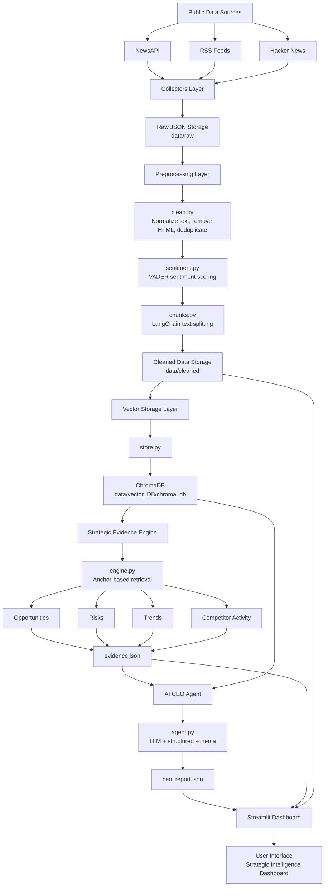

# AI-CEO: Strategic Intelligence Agent for NVIDIA

AI-CEO is a Python-based strategic intelligence system that collects public information about NVIDIA and the semiconductor/AI-computing market, processes the collected documents, stores them in a vector database, extracts strategic evidence, and generates a CEO-style strategic briefing using a Retrieval-Augmented Generation (RAG) agent.

The project is designed around the question:

> **If you were the CEO of NVIDIA today, what would you do next and why?**

---

## Project Overview

This system acts like an AI strategic advisor. It gathers information from news and discussion sources, cleans and enriches the data, chunks the documents, stores the chunks in ChromaDB, retrieves relevant context, identifies strategic signals, and generates an evidence-backed CEO briefing.

### Main Goals

- Automate public data collection about NVIDIA and related competitors.
- Convert raw articles/posts into clean, structured documents.
- Perform sentiment analysis on collected documents.
- Chunk documents for retrieval.
- Store chunks in a persistent ChromaDB vector database.
- Extract strategic evidence such as opportunities, risks, trends, and competitor activity.
- Generate a structured CEO briefing using a local Hugging Face LLM.
- Display the final strategic intelligence output through a Streamlit dashboard.

---

## Tech Stack

| Layer | Tools / Libraries |
|---|---|
| Programming Language | Python |
| Data Collection | `requests`, `feedparser`, `BeautifulSoup` |
| Environment Variables | `python-dotenv` |
| Preprocessing | `re`, `html`, JSON processing |
| Sentiment Analysis | `vaderSentiment` |
| Chunking | `langchain-text-splitters` |
| Vector Database | ChromaDB |
| LLM / RAG | Hugging Face Transformers, PyTorch, BitsAndBytes |
| Structured Output | Outlines, Pydantic schema |
| Dashboard | Streamlit, Plotly, Pandas |
| Tunneling / Public URL | Pyngrok |

---

## Folder Architecture

```text
AI-CEO/
│
├── agent/
│   ├── agent.py                 # Main AI CEO agent that generates structured CEO briefing
│   └── schema.py                # Pydantic schema for controlled/structured agent output
│
├── automate/
│   ├── block_1.py               # Automation block for part of the pipeline
│   ├── block_2.py               # Automation block for later pipeline stages
│   └── full.py                  # Full automation script
│
├── collectors/
│   ├── hackernews_collector.py  # Collects NVIDIA-related Hacker News content
│   ├── newsapi_collector.py     # Collects NVIDIA-related articles from NewsAPI
│   ├── reddit_collector.py      # Collects posts from selected subreddits
│   ├── rss_collector.py         # Collects articles from RSS feeds
│   └── run_pipeline.py          # Runs collectors in sequence
│
├── config/
│   ├── paths.py                 # Centralized file and folder paths
│   └── settings.py              # Project constants such as model name, chunk size, top-k, etc.
│
├── dashboard/
│   ├── dashboard.py             # Streamlit dashboard for visualizing final outputs
│   └── tunnel.py                # Optional tunneling support
│
├── data/
│   ├── raw/
│   │   ├── hackernews_data.json # Raw Hacker News data
│   │   ├── newsapi_data.json    # Raw NewsAPI data
│   │   └── rss_data.json        # Raw RSS data
│   │
│   ├── cleaned/
│   │   ├── clean_documents.json     # Cleaned and normalized documents
│   │   ├── sentiment_analysis.json  # Documents enriched with sentiment labels/scores
│   │   └── chunks.json              # Chunked documents ready for vector storage
│   │
│   ├── evidence/
│   │   ├── evidence.json        # Strategic evidence generated by the evidence engine
│   │   └── ceo_report.json      # Final CEO briefing/report generated by the agent
│   │
│   └── vector_DB/
│       └── chroma_db/
│           ├── chroma.sqlite3   # ChromaDB local database file
│           └── <uuid-folder>/   # ChromaDB internal vector/index storage
│
├── engine/
│   └── engine.py                # Rule-based strategic evidence engine
│
├── preprocess/
│   ├── clean.py                 # Cleans raw documents from collectors
│   ├── sentiment.py             # Adds sentiment score and sentiment label
│   └── chunks.py                # Splits documents into chunks
│
├── rag/
│   ├── prompt.py                # Prompt templates for RAG and CEO agent
│   └── rag.py                   # RAG pipeline for retrieving context and generating answers
│
├── storage/
│   └── store.py                 # Stores document chunks in ChromaDB
│
├── main.py                      # Starts Streamlit dashboard with optional ngrok tunnel
├── app.py                       # Full Automation from Start to End
├── requirements.txt             # Python dependencies
├── .gitignore                   # Git ignore rules
└── streamlit.log                # Streamlit runtime log file
```

---

## System Architecture



---

## Pipeline Flow

### 1. Data Collection

The collectors gather NVIDIA-related information from external public sources.

```bash
python -m collectors.run_pipeline
```

This runs the configured collectors and stores raw JSON files inside:

```text
data/raw/
```

Expected outputs include:

```text
data/raw/newsapi_data.json
data/raw/rss_data.json
data/raw/hackernews_data.json
```

---

### 2. Data Cleaning

Raw documents are cleaned, normalized, and converted into a common structure.

```bash
python -m preprocess.clean
```

Output:

```text
data/cleaned/clean_documents.json
```

---

### 3. Sentiment Analysis

The cleaned documents are enriched with sentiment scores and labels using VADER sentiment analysis.

```bash
python -m preprocess.sentiment
```

Output:

```text
data/cleaned/sentiment_analysis.json
```

---

### 4. Chunking

Documents are split into smaller chunks so they can be stored and retrieved efficiently.

```bash
python -m preprocess.chunks
```

Output:

```text
data/cleaned/chunks.json
```

---

### 5. Store Chunks in ChromaDB

The chunked documents are inserted into a persistent ChromaDB collection.

```bash
python -m storage.store
```

Output:

```text
data/vector_DB/chroma_db/
```

---

### 6. Generate Strategic Evidence

The strategic evidence engine retrieves relevant chunks from ChromaDB and builds structured evidence around opportunities, risks, trends, and competitor activity.

```bash
python -m engine.engine
```

Output:

```text
data/evidence/evidence.json
```

---

### 7. Generate CEO Briefing

The AI CEO agent uses the strategic evidence and retrieved context to generate a structured CEO report.

```bash
python -m agent.agent
```

Output:

```text
data/evidence/ceo_report.json
```

---

### 8. Run the Dashboard

Use Streamlit to view the project dashboard.

```bash
streamlit run dashboard/dashboard.py
```

You can also run:

```bash
python main.py
```

`main.py` starts the Streamlit dashboard and can expose it through ngrok if configured.

---

## Installation

### 1. Clone the Repository

```bash
git clone -b master https://github.com/yuvrajghag5/AI-CEO.git
cd AI-CEO
```

### 2. Create a Virtual Environment

```bash
python -m venv .venv
```

Activate it:

**Windows PowerShell**

```bash
.venv\Scripts\Activate.ps1
```

**Linux / macOS**

```bash
source .venv/bin/activate
```

### 3. Install Dependencies

```bash
pip install -r requirements.txt
```

---

## Environment Variables

Create a `.env` file in the project root for API keys.

```env
NEWS_API_KEY=your_newsapi_key_here
```

Important: API keys should not be hardcoded in Python files or committed to GitHub. Keep them inside `.env` and load them using `python-dotenv`.

---

## Recommended Execution Order

Run the project in this order:

```bash
python -m collectors.run_pipeline
python -m preprocess.clean
python -m preprocess.sentiment
python -m preprocess.chunks
python -m storage.store
python -m engine.engine
python -m agent.agent
streamlit run dashboard/dashboard.py
```

---

## Key Project Modules

### `collectors/`

Responsible for collecting raw market/news/discussion data about NVIDIA.

- `newsapi_collector.py`: Fetches articles from NewsAPI.
- `rss_collector.py`: Fetches articles from RSS feeds.
- `hackernews_collector.py`: Fetches Hacker News stories and comments.
- `run_pipeline.py`: Runs selected collectors in sequence.

### `preprocess/`

Converts raw data into usable documents.

- `clean.py`: Cleans and normalizes raw data.
- `sentiment.py`: Adds sentiment labels and scores.
- `chunks.py`: Splits documents into chunks.

### `storage/`

Stores document chunks inside ChromaDB for retrieval.

### `engine/`

Extracts strategic evidence using rule-based anchor retrieval. It searches for signals related to:

- Opportunities
- Risks
- Market/technology trends
- Competitor activity

### `rag/`

Contains the RAG prompt and retrieval-based generation pipeline.

### `agent/`

Generates the final structured CEO briefing using:

- Strategic evidence from `evidence.json`
- Extra retrieved context from ChromaDB
- A local Hugging Face model
- Pydantic schema validation through `schema.py`

### `dashboard/`

Displays the final project output using Streamlit and Plotly.

---

## Output Files

| File | Purpose |
|---|---|
| `data/raw/*.json` | Raw collected data |
| `data/cleaned/clean_documents.json` | Cleaned documents |
| `data/cleaned/sentiment_analysis.json` | Sentiment-enriched documents |
| `data/cleaned/chunks.json` | Chunked documents |
| `data/vector_DB/chroma_db/` | Persistent ChromaDB storage |
| `data/evidence/evidence.json` | Strategic evidence output |
| `data/evidence/ceo_report.json` | Final CEO strategic briefing |

---

## Notes and Improvements

- Move all API keys to `.env` before pushing the repository publicly.
- Add `.ipynb_checkpoints/`, logs, and generated data files to `.gitignore` if they should not be versioned.
- Keep `data/raw`, `data/cleaned`, `data/evidence`, and `data/vector_DB` optional in Git if the repository should stay lightweight.
- Add better exception handling for network/API failures in collectors.
- Add a single automation entry point that runs the full pipeline from collection to dashboard.
- Add unit tests for collectors, cleaning, chunking, and evidence generation.

---

## Example Use Case

A user wants to understand what NVIDIA should strategically do next. The system collects recent public evidence, identifies market signals, retrieves relevant context, and generates a CEO-style briefing with recommendations, expected impact, risk level, and supporting sources.

---

## Author

**Yuvraj Ghag**

GitHub: [@yuvrajghag5](https://github.com/yuvrajghag5)
