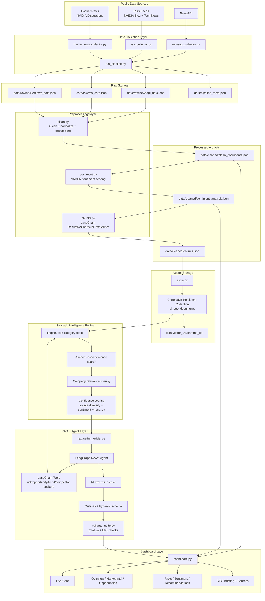

# AI-CEO: Strategic Intelligence Agent for NVIDIA

AI-CEO is an evidence-grounded strategic intelligence system that collects public NVIDIA-related information, turns the data into a searchable knowledge base, retrieves strategic signals, and generates a CEO-style briefing through a RAG-powered ReAct agent.

The project is built around one core question:

> If you were the CEO of NVIDIA today, what strategic decision would you make next, and why?

Instead of generating a generic LLM answer, the system first builds an internal evidence base from public data sources, retrieves relevant context through ChromaDB, reasons over risks/opportunities/trends/competitor activity, and then produces a structured CEO briefing with validated source references.

---

## Table of Contents

- [Project Overview](#project-overview)
- [Key Features](#key-features)
- [System Architecture](#system-architecture)
- [Data-Flow Diagram](#data-flow-diagram)
- [AI Pipeline](#ai-pipeline)
- [Tech Stack](#tech-stack)
- [Repository Structure](#repository-structure)
- [Design Decisions](#design-decisions)
- [Installation](#installation)
- [Environment Variables](#environment-variables)
- [How to Run](#how-to-run)
- [Output Schema](#output-schema)
- [Dashboard](#dashboard)
- [Limitations](#limitations)
- [Future Improvements](#future-improvements)

---

## Project Overview

AI-CEO acts as an AI strategic advisor for NVIDIA. It collects market/news/community intelligence, cleans and enriches the text, chunks the documents, stores them in a persistent vector database, retrieves evidence using category-specific strategic search, and generates a CEO briefing using a local Hugging Face LLM.

The system is divided into six main blocks:

1. **Data Collection** – collects public NVIDIA-related data from NewsAPI, RSS feeds, and Hacker News.
2. **Preprocessing** – cleans raw text, removes duplicates, performs sentiment analysis, and creates chunks.
3. **Vector Storage** – stores chunks and metadata in ChromaDB for semantic retrieval.
4. **Strategic Intelligence Engine** – retrieves evidence for opportunities, risks, trends, and competitor activity.
5. **RAG + ReAct Agent** – uses LangGraph tools and RAG evidence to generate structured CEO intelligence.
6. **Dashboard** – displays the live agent chat, evidence, sentiment, opportunities, risks, recommendations, and CEO briefing.

---

## Key Features

- Automated NVIDIA-focused public data collection.
- Cleaning, normalization, deduplication, sentiment analysis, and chunking.
- Persistent ChromaDB vector store for reusable semantic retrieval.
- Strategic evidence engine with category-aware anchor search.
- ReAct-style LangGraph agent with tool-based evidence gathering.
- Schema-constrained generation using Pydantic and Outlines.
- Fixed CEO briefing structure for consistent output.
- Citation and URL validation to reduce hallucinated evidence.
- Streamlit dashboard with live chat and seven intelligence panels.
- Separate knowledge-base build stage and live intelligence stage.

---

## System Architecture



---

## Data-Flow Diagram

```mermaid
flowchart LR
    U[User Strategic Question] --> AG[LangGraph ReAct Agent]

    subgraph KB[Knowledge Base Build Flow]
        DS[Public Sources] --> RAW[Raw JSON Files\ndata/raw]
        RAW --> CLEAN[Clean Documents\ndata/cleaned/clean_documents.json]
        CLEAN --> SENT[Sentiment-Enriched Documents\ndata/cleaned/sentiment_analysis.json]
        SENT --> CHUNK[Chunks\ndata/cleaned/chunks.json]
        CHUNK --> CHROMA[ChromaDB\ndata/vector_DB/chroma_db]
    end

    subgraph RET[Retrieval + Evidence Flow]
        CHROMA --> SEEK[engine.seek]
        SEEK --> CAT1[Risk Evidence]
        SEEK --> CAT2[Opportunity Evidence]
        SEEK --> CAT3[Trend Evidence]
        SEEK --> CAT4[Competitor Evidence]
        CAT1 --> RAG[Numbered Evidence Block\nS1, S2, S3...]
        CAT2 --> RAG
        CAT3 --> RAG
        CAT4 --> RAG
    end

    AG --> TOOLS[LangChain Tool Calls]
    TOOLS --> SEEK
    RAG --> PROMPT[CEO Briefing Prompt]
    PROMPT --> LLM[Mistral-7B-Instruct]
    LLM --> SCHEMA[Pydantic CEOBriefing Schema]
    SCHEMA --> VALIDATE[Citation + URL Validation]
    VALIDATE --> REPORT[CEO Report\ndata/evidence/ceo_report.json]
    REPORT --> DASH[Streamlit Dashboard]
    DASH --> USER[User Reads Briefing]
```



---

## AI Pipeline

### 1. Data Collection

The collection pipeline gathers NVIDIA-related intelligence from:

- **NewsAPI** – current news articles matching NVIDIA, AI, chips, GPU, datacenter, stock, earnings, and Jensen Huang queries.
- **RSS feeds** – NVIDIA blog and selected technology news feeds.
- **Hacker News** – NVIDIA-related stories and discussion comments through the Algolia HN API.

The collector outputs are stored in:

```text
data/raw/newsapi_data.json
data/raw/rss_data.json
data/raw/hackernews_data.json
```

### 2. Cleaning and Deduplication

`preprocess/clean.py` loads the raw files, removes HTML, decodes entities, normalizes whitespace, filters very short documents, and skips duplicates using URL/title-based keys.

Output:

```text
data/cleaned/clean_documents.json
```

### 3. Sentiment Analysis

`preprocess/sentiment.py` applies VADER sentiment scoring to the cleaned documents and adds:

- `sentiment_label`: positive / neutral / negative
- `sentiment_score`: compound score

Output:

```text
data/cleaned/sentiment_analysis.json
```

### 4. Chunking

`preprocess/chunks.py` uses LangChain's `RecursiveCharacterTextSplitter` to split documents into retrieval-friendly chunks.

Current default settings:

```python
CHUNK_SIZE = 400
CHUNK_OVERLAP = 40
```

Output:

```text
data/cleaned/chunks.json
```

### 5. Vector Storage

`storage/store.py` stores each chunk in a persistent ChromaDB collection named:

```text
ai_ceo_documents
```

The stored metadata includes:

- `doc_id`
- `source`
- `title`
- `url`
- `published_date`
- `sentiment_label`
- `sentiment_score`

Vector database location:

```text
data/vector_DB/chroma_db/
```

### 6. Strategic Evidence Retrieval

`engine/engine.py` exposes the main retrieval function:

```python
seek(category, topic)
```

Supported categories:

```text
opportunities
risks
trends
competitor_activity
```

The engine improves retrieval quality by combining the user topic with category-specific anchor phrases. For example, a risk query is not searched as only `supply chain`; it becomes risk-shaped searches such as:

```text
supply chain regulatory investigation
supply chain competitive threat
supply chain supply chain disruption
supply chain negative public sentiment
```

The engine then:

1. Searches ChromaDB semantically.
2. Keeps only chunks mentioning NVIDIA or relevant competitors.
3. Scores evidence using source diversity, sentiment fit, and recency.
4. Returns diverse evidence from distinct documents.

### 7. RAG Evidence Assembly

`rag/rag.py` runs `seek()` across all four strategic categories and builds a numbered evidence block:

```text
S1, S2, S3, ...
```

These source IDs become the only valid citation IDs for the final CEO briefing.

### 8. ReAct Agent

`agent/react_agent.py` implements a LangGraph ReAct-style workflow:

```text
Goal → Plan → Retrieve → Analyze → Decide → Recommend → Validate
```

The agent uses LangChain tools from `agent/tools.py`:

- `risk_seeker`
- `opportunity_seeker`
- `trend_seeker`
- `competitor_activity_seeker`
- `generate_ceo_briefing`

For broad strategic questions, the agent generates a full CEO briefing. For narrower questions, it can call a smaller subset of tools.

### 9. Schema-Constrained CEO Briefing

`agent/briefing.py` combines:

- evidence from `rag.gather_evidence()`
- prompt template from `agent/prompt.py`
- Mistral model from `agent/model.py`
- Pydantic schema from `agent/schema.py`
- Outlines structured generation

This forces the final CEO briefing into a predictable schema instead of relying on free-form LLM text.

### 10. Validation

`agent/validate_node.py` performs deterministic validation after generation:

1. Checks whether every cited source ID, such as `S1`, `S2`, exists in the actual retrieved source lookup.
2. Checks whether URLs in the final answer appear in the gathered evidence.

This helps reduce fabricated citations and hallucinated links.

### 11. Dashboard

`dashboard/dashboard.py` displays:

- live chat with the AI CEO agent
- source breakdown
- market intelligence
- opportunity monitor
- risk monitor
- sentiment analysis
- strategic recommendations
- CEO briefing and source references

---

## Tech Stack

| Layer | Tools / Libraries |
|---|---|
| Programming Language | Python |
| Data Collection | `requests`, `feedparser`, `BeautifulSoup` |
| Environment Variables | `python-dotenv` / `dotenv` |
| Data Processing | `json`, `re`, `html`, `pandas` |
| Sentiment Analysis | `vaderSentiment` |
| Chunking | `langchain-text-splitters` |
| Vector Database | `chromadb` |
| Agent Framework | `langgraph`, `langchain-core` |
| LLM Interface | `transformers`, `torch`, `accelerate`, `bitsandbytes` |
| Structured Generation | `outlines`, `pydantic` |
| Dashboard | `streamlit`, `plotly`, `pandas` |
| Public Dashboard Tunnel | `pyngrok` |

---

## Repository Structure

```text
AI-CEO/
│
├── agent/
│   ├── briefing.py          # Generates schema-constrained CEO briefing
│   ├── model.py             # Loads Mistral model once and reuses it
│   ├── plan_node.py         # Planning stage for the LangGraph agent
│   ├── prompt.py            # CEO briefing prompt template
│   ├── react_agent.py       # Main LangGraph ReAct agent
│   ├── schema.py            # Pydantic CEO briefing schema
│   ├── tools.py             # LangChain tools wrapping strategic seekers
│   └── validate_node.py     # Citation and URL validation
│
├── automate/
│   ├── block_1.py           # Knowledge-base build automation
│   ├── block_2.py           # Later-stage automation script
│   └── full.py              # Full automation wrapper
│
├── collectors/
│   ├── hackernews_collector.py
│   ├── newsapi_collector.py
│   ├── reddit_collector.py
│   ├── rss_collector.py
│   └── run_pipeline.py
│
├── config/
│   ├── paths.py             # Centralized project paths
│   └── settings.py          # Model, chunking, retrieval, and generation settings
│
├── dashboard/
│   ├── dashboard.py         # Streamlit intelligence dashboard
│   └── tunnel.py            # Optional ngrok tunnel helper
│
├── data/
│   ├── raw/                 # Raw collected data
│   ├── cleaned/             # Cleaned docs, sentiment docs, and chunks
│   ├── evidence/            # Latest CEO report output
│   └── vector_DB/           # Persistent ChromaDB store
│
├── engine/
│   └── engine.py            # Strategic evidence retrieval engine
│
├── preprocess/
│   ├── chunks.py            # Chunk generation
│   ├── clean.py             # Cleaning and deduplication
│   └── sentiment.py         # VADER sentiment scoring
│
├── rag/
│   ├── __init__.py
│   └── rag.py               # Evidence gathering and RAG formatting
│
├── storage/
│   └── store.py             # Stores chunks in ChromaDB
│
├── app.py
├── main.py                  # Starts Streamlit dashboard with ngrok tunnel
├── requirements.txt
└── README.md
```

---

## Design Decisions

### 1. Separate Knowledge-Base Build from Live Agent Execution

Data collection and embedding are slower operations, so they are separated from the live dashboard/agent stage. This allows the knowledge base to be rebuilt only when new data is collected, while the dashboard and agent can reuse the existing ChromaDB collection.

### 2. ChromaDB for Persistent Local Retrieval

ChromaDB is used because the project needs a simple local vector store that persists chunks and metadata without requiring a hosted vector database. This is suitable for an academic/local prototype where the dataset is moderate and deployment complexity should stay low.

### 3. Category-Aware Retrieval Instead of Generic Search

The strategic engine does not retrieve using only the raw user topic. It combines the topic with category anchors such as `regulatory investigation`, `new product launch`, `competitor product launch`, and `technology adoption trend`. This makes the retrieval strategy more aligned with business intelligence needs.

### 4. Evidence Filtering for NVIDIA and Competitors

Retrieved chunks are filtered to keep only evidence mentioning NVIDIA or known semiconductor/AI competitors such as AMD, Intel, Qualcomm, Broadcom, TSMC, Samsung, Arm, Micron, and ASML. This reduces off-topic retrieval noise.

### 5. Confidence Scoring Before Generation

The engine computes confidence using:

- source diversity
- sentiment fit
- recency

This gives the agent stronger context about whether evidence is strong, weak, recent, or one-sided.

### 6. Structured Generation Instead of Free-Form Output

The final CEO briefing is generated through a Pydantic schema and Outlines. This is important because CEO reports must follow the same structure every time.

### 7. Deterministic Formatting

After the briefing is generated as a structured dictionary, `react_agent.py` formats the final answer deterministically. This avoids inconsistent LLM retellings and keeps the output stable across runs.

### 8. Citation Validation

The validation node checks whether citation IDs and URLs actually appear in the retrieved evidence. This adds an extra safety layer against invented sources.

---

## Installation

### 1. Clone the master branch

```bash
git clone -b master https://github.com/yuvrajghag5/AI-CEO.git
cd AI-CEO
```

### 2. Create a virtual environment

Windows PowerShell:

```powershell
python -m venv .venv
.venv\Scripts\Activate.ps1
```

Linux / macOS:

```bash
python -m venv .venv
source .venv/bin/activate
```

### 3. Install dependencies

```bash
pip install -r requirements.txt
```

---

## Environment Variables

Create a `.env` file in the project root:

```env
NEWS_API_KEY=your_newsapi_key_here
```

Recommended security practice:

```python
API_KEY = os.getenv("NEWS_API_KEY")
```

Do not commit real API keys to GitHub.

---

## How to Run

### Option 1: Build / update the knowledge base

Run the first automation block:

```bash
python -m automate.block_1
```

This runs:

```text
collectors.run_pipeline
preprocess.clean
preprocess.sentiment
preprocess.chunks
storage.store
```

### Option 2: Run each stage manually

```bash
python -m collectors.run_pipeline
python -m preprocess.clean
python -m preprocess.sentiment
python -m preprocess.chunks
python -m storage.store
```

### Option 3: Test the strategic engine

```bash
python -m engine.engine
```

This checks whether ChromaDB contains chunks and runs sample strategic searches.

### Option 4: Run the interactive AI CEO agent

```bash
python -m agent.react_agent
```

Example questions:

```text
If you were the CEO of NVIDIA today, what would you do next and why?
What are NVIDIA's biggest risks in AI infrastructure?
How should NVIDIA respond to AMD and Intel in the data center GPU market?
What strategic opportunities exist around AI chips and data centers?
```

### Option 5: Run the dashboard directly

```bash
streamlit run dashboard/dashboard.py
```

### Option 6: Run dashboard with ngrok tunnel

```bash
python main.py
```

`main.py` starts Streamlit on port `8501` and opens an ngrok tunnel.

---

## Output Schema

The CEO briefing is generated using the `CEOBriefing` Pydantic schema.

Expected structure:

```text
CEOBriefing
├── executive_summary
├── key_opportunities              # exactly 3
│   ├── opportunity
│   ├── business_impact
│   └── supporting_evidence        # exactly 3 IDs
├── key_risks                      # exactly 3
│   ├── risk
│   ├── why_it_matters
│   └── supporting_evidence        # exactly 3 IDs
├── competitor_activity            # exactly 2
│   ├── competitor_activity
│   ├── strategic_meaning
│   └── supporting_evidence        # exactly 3 IDs
├── emerging_trends                # exactly 2
│   ├── trend
│   ├── strategic_meaning
│   └── supporting_evidence        # exactly 3 IDs
├── strategic_recommendations      # exactly 3
│   ├── recommendation
│   ├── priority                   # High / Medium / Low
│   ├── supporting_evidence        # exactly 3 IDs
│   ├── expected_impact
│   └── risk_level                 # High / Medium / Low
└── ceo_action_plan                # exactly 3 concrete actions
```

---

## Dashboard

The Streamlit dashboard contains seven panels:

1. **Overview** – company profile, document count, source mix, last update.
2. **Market Intel** – competitor activity and emerging trends.
3. **Opportunities** – key strategic opportunities from the latest briefing.
4. **Risks** – risk monitor from the latest briefing.
5. **Sentiment** – sentiment distribution, sentiment by source, and recent trend.
6. **Recommendations** – strategic recommendations with priority and risk level.
7. **CEO Briefing** – executive summary, action plan, validation status, and sources.

The left side of the dashboard contains a live chat interface connected to `agent.react_agent.ask()`.

---

## Limitations

- The quality of the final briefing depends on the quality and freshness of collected documents.
- Some websites may block scraping, return paywalled content, or provide limited article text.
- Local Mistral-7B inference may require significant GPU memory and can be slow on CPU-only systems.
- The vector database reflects only the latest stored chunks; run the knowledge-base build stage again after collecting new data.
- API keys must be handled securely through `.env` and should not be committed.

---

## Future Improvements

- Add more reliable financial and market data sources.
- Replace hard-coded queries with configurable company/competitor profiles.
- Add scheduled data collection.
- Add source-quality ranking and duplicate-source clustering.
- Add automatic export of CEO reports to PDF or Markdown.
- Add evaluation metrics for retrieval quality and citation accuracy.
- Add Docker support for easier setup.
- Add unit tests for collectors, preprocessing, retrieval, and schema validation.

---

## Project Goal

The purpose of AI-CEO is not only to generate a report, but to demonstrate a complete AI decision-support pipeline:

```text
Public Data → Clean Knowledge Base → Vector Retrieval → Strategic Evidence → RAG Agent → Validated CEO Briefing → Dashboard
```

This makes the system more reliable than a plain chatbot because every strategic recommendation is grounded in retrieved internal evidence.
